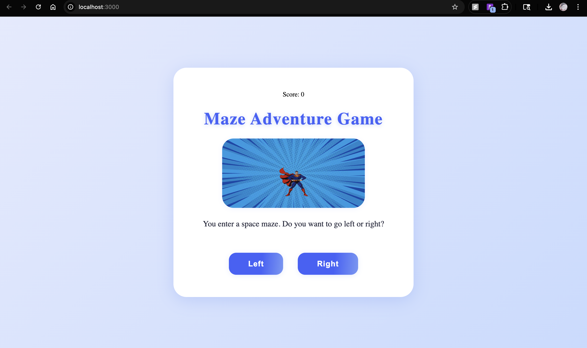
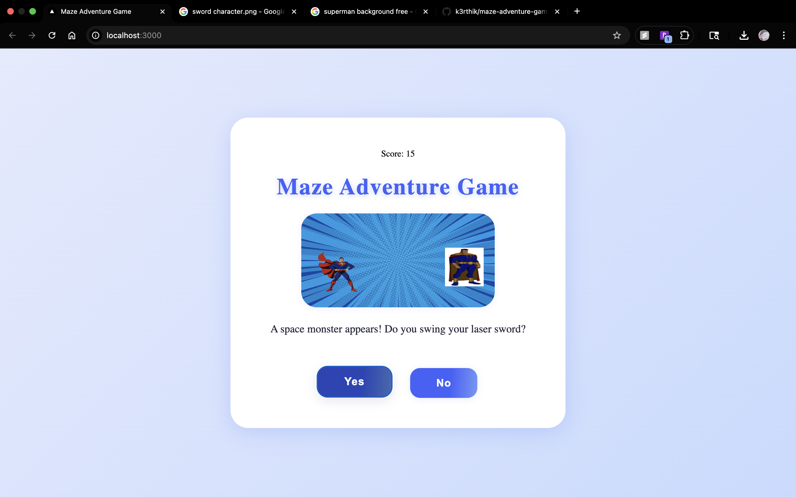
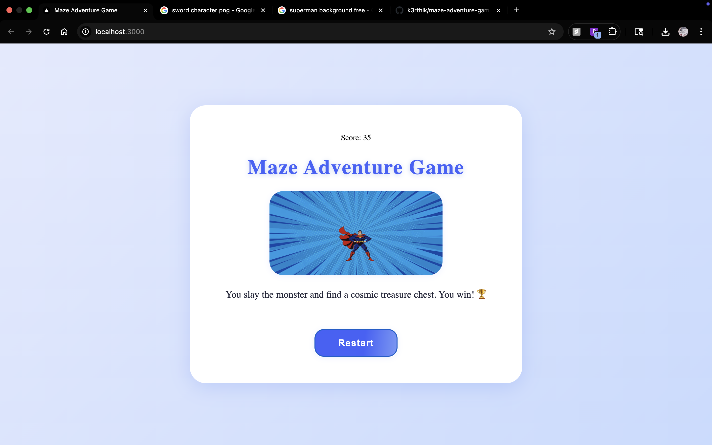

# 🚀 Maze Adventure Game (React)

This is a simple, interactive "choose your own adventure" web game built with React.  
**Note:** This is not a full-featured or professional game—it's a project for learning JavaScript and React.

I created this project to practice JavaScript, React components, state, and basic game logic.  
You guide a character through a space-themed maze, make choices, see different outcomes, and collect a score as you play.  
The code is easy to read and modify, so you can extend it or use it as a template for your own learning.

---

## Features

- Story branches with multiple endings
- Simple animated character and images
- Score system based on your choices
- Modern, responsive design
- Space background for fun!

---

## Screenshots

| Game Start                     | Monster Encounter               | Victory!                       |
|------------------------------- | -------------------------------| ------------------------------ |
|          |          |          |

---

## Getting Started

### 1. Clone the repo

```sh
git clone https://github.com/YOUR-USERNAME/maze-adventure-game.git
cd maze-adventure-game
```

### 2. Install dependencies

```sh
npm install
```

### 3. Run the development server

```sh
npm start
```
Open [http://localhost:3000](http://localhost:3000) in your browser.

---

## Project Structure

```
maze-adventure-game/
├── public/
│   └── index.html
├── src/
│   ├── App.css
│   ├── App.js
│   ├── MazeGame.jsx
│   ├── index.js
│   ├── character.png
│   ├── monster.jpeg
│   ├── ladder.png
│   ├── sword.jpg
│   └── space.avif
├── game1.png
├── game2.png
├── game3.png
├── package.json
├── LICENSE
└── README.md
```

---

## How to Play

- Choose your path through the space maze.
- Make smart decisions to collect items, defeat monsters, and escape!
- Your score is shown at the top right—try to win with the highest score.

---

## How to Extend

- Add new images to `src/`
- Edit story nodes in `MazeGame.jsx` for more adventure!
- Customize styles in `App.css` for your own theme.

---

## Deployment

To build for production:
```sh
npm run build
```
This creates a `build/` folder with your static site, ready to deploy (e.g. to GitHub Pages, Vercel, Netlify).

---

## License

This project is licensed under the MIT License.  
This project is for learning and demo purposes.  
Character and background images are from [Kenney.nl](https://kenney.nl/) and Google.

---

> **This project is for my own JavaScript/React learning.  
> Suggestions, feedback, and PRs are always welcome!**

---
